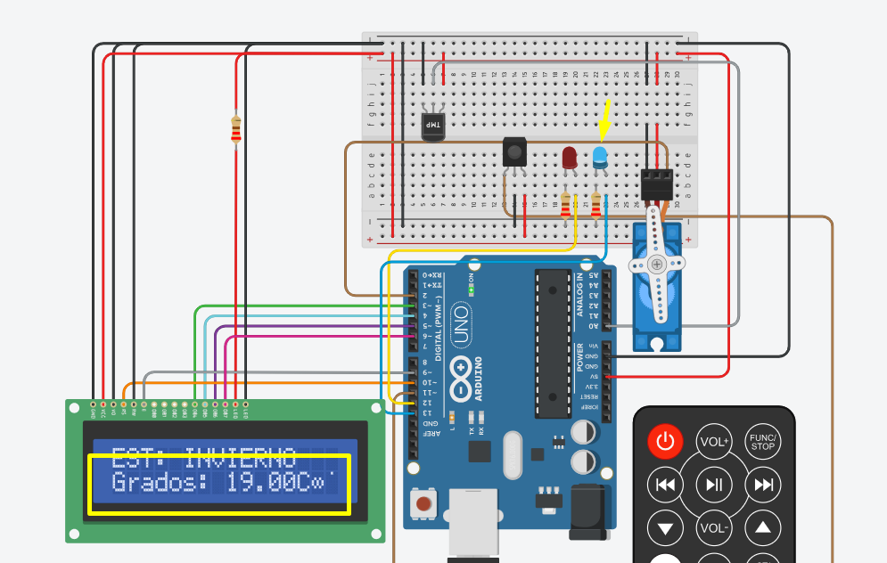
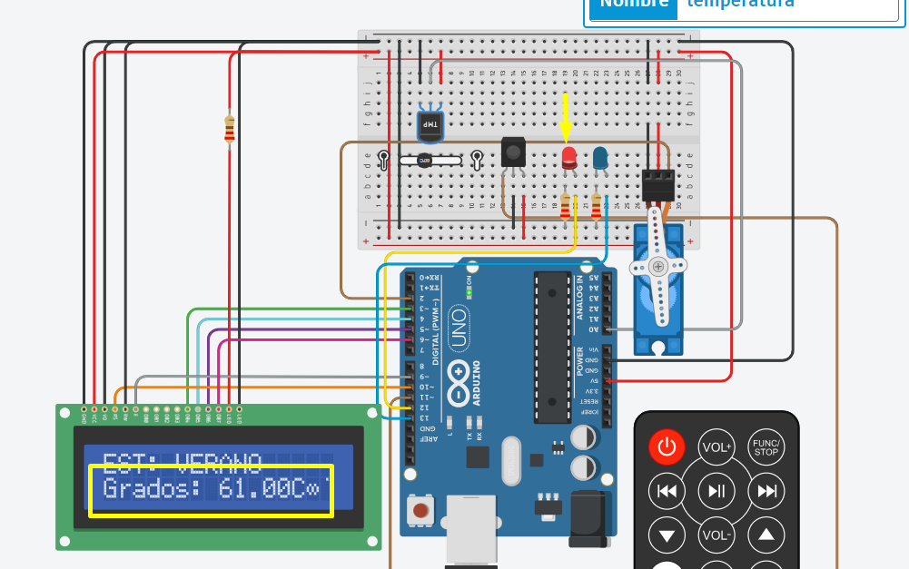
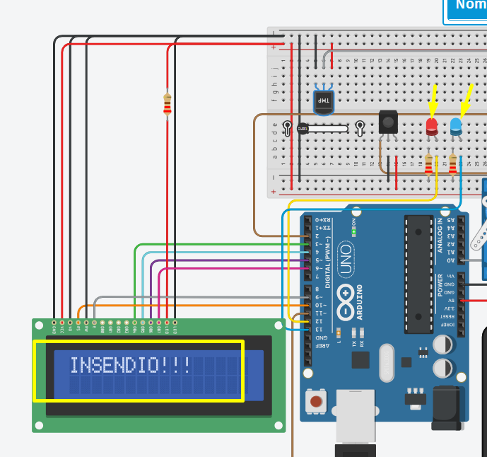
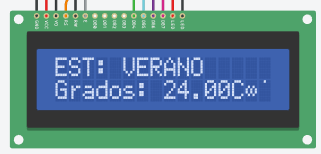
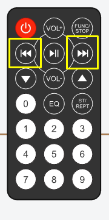

# Sistema de incendio

Es un sistema de incendio llevado a cabo con Arduino que puede detectar la temperatura y activar la defensa contra calor en caso de un incendio. 

## Funciones del sistema:
A continuación se llevara a cabo las funcionalidades del sistema y como activa las defensas ante los incendios.

### Notificaciones de temperatura

Se le notificara al usuario con un led de color azul en caso que la temperatura se encuenta estable y no se corre riesgo de insendio. Como se vera en la proxima imagen:
 
{withd:80}
 
En el caso que se eleve la temperatura ambiente de forma riesgoza se le notificara con un led rojo una posible sobre carga de calor para que tenga cuidado ante un posible insendio. Como se vera en la proxima imagen:
 
{withd:80}
 
Al detectarse el insendio se informara por display notificando al usuario y se activaran ambos leds de forma intermitente. 
 

 

### Display

Se localizara un display en el artefacto marcando la temperatua ambiente actual. Y la estacion del año que se encuentra actualmente. 
 

 
### Servo Motor

En el caso que se identifique el insendio producido a tanto grados Celsius. Se encendera el servo motor como autodefensa y reaccionar ante el insendio. 

### Control IR

Se le proporcionara al usuario un control remoto que podra modificar las diferentes estaciones del año a traves de un sensor infrarojo vinculado a dicho control. Permitiendo adminitras las diferentes temperaturas que se encuentran diariamente. Cada estacion es identificada a traves de un ID y este se modificara hacia la derecha o hacia la izquieda. Los ID son los siguientes:
* **Verano**    => 1
* **Otoño**     => 2
* **Invierno**  => 3
* **Primavera** => 4
Los botones de accion del control remoto son los de desplazamiento siguiente o anterior. Las funcionalidades del boton son las suiguentes:
 

 
: Permite modificar la estacion a la siguiente, en este caso sumar 1 al ID (ID+1) 
: Permite modificar la estacion a la anterior, en este caso restar 1 al ID (ID-1)